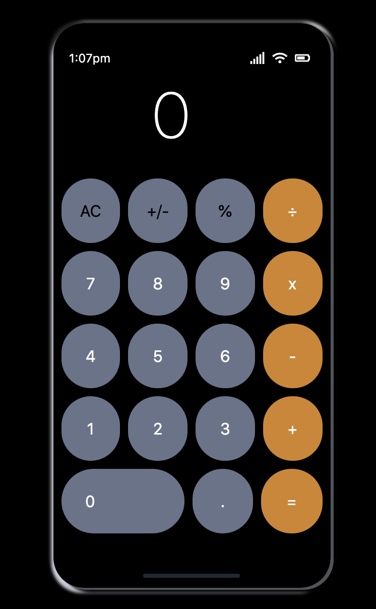

# Iphone Calculator

## Table of contents
* [General info](#general-info)
* [Technologies](#technologies)
* [Setup](#setup)

## General info
This is a replica of the Iphone 8 Calculator using html,css and javascript. You are able to add, subtract, multiply, and divide. The purpose of this project is to showcase my UI skills. This was built using vanilla JavaScript.
	
## Technologies
Project is created with:
* JAVASCRIPT
* HTML
* CSS
	
## Setup
To run this project, you may download it into your code editor and use local host or you may click the link below which is hosted on netlify.
[Click me to see this magic!!](https://brave-mcclintock-e54bfa.netlify.app/)

